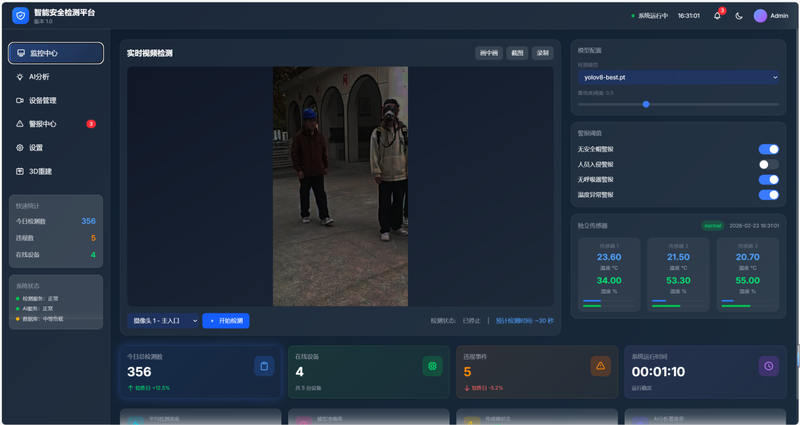
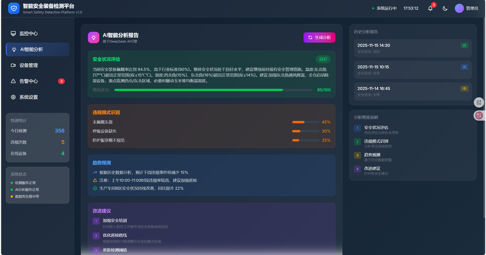
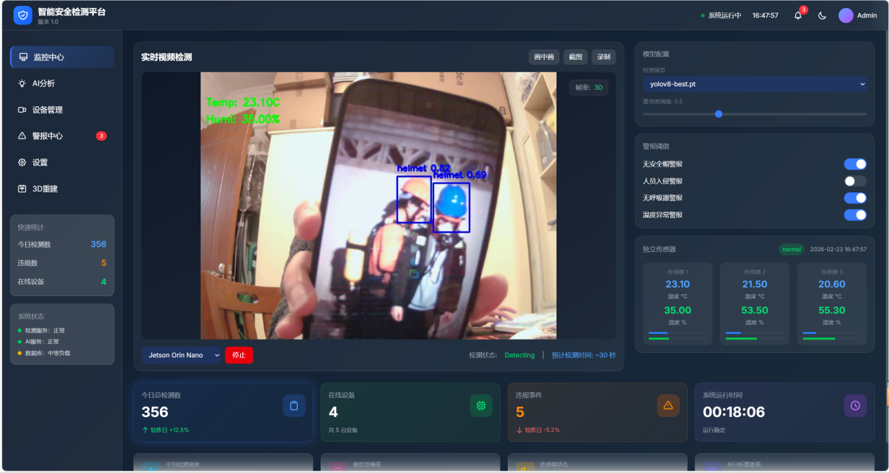
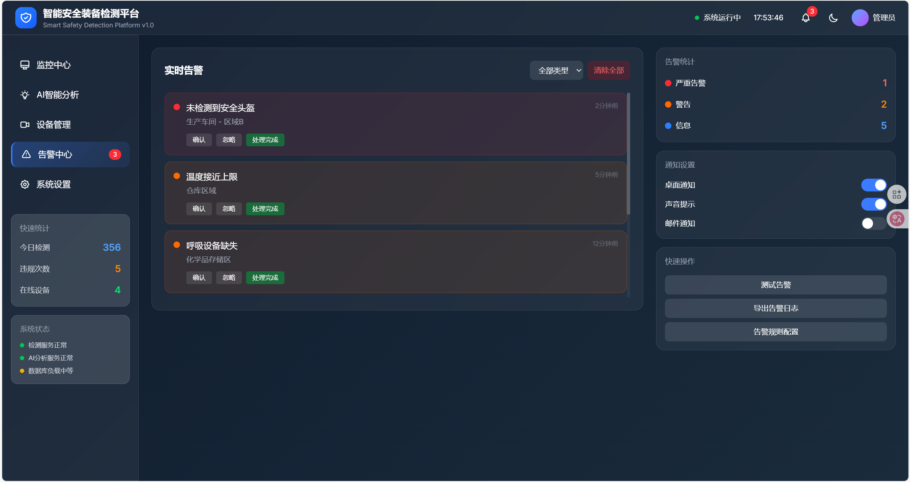
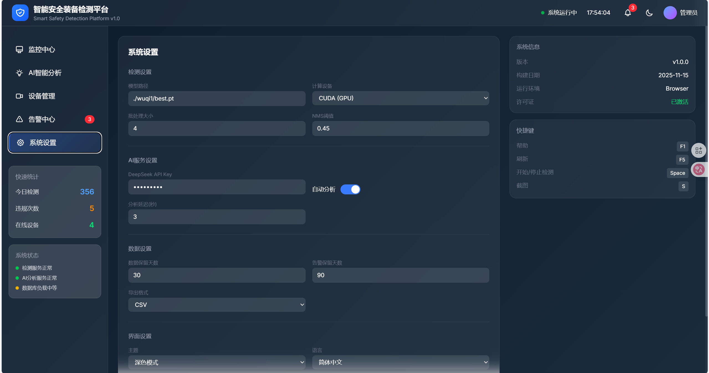
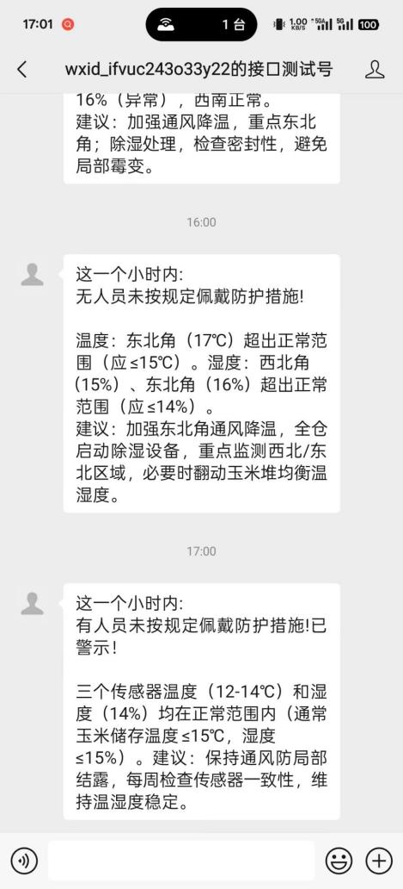
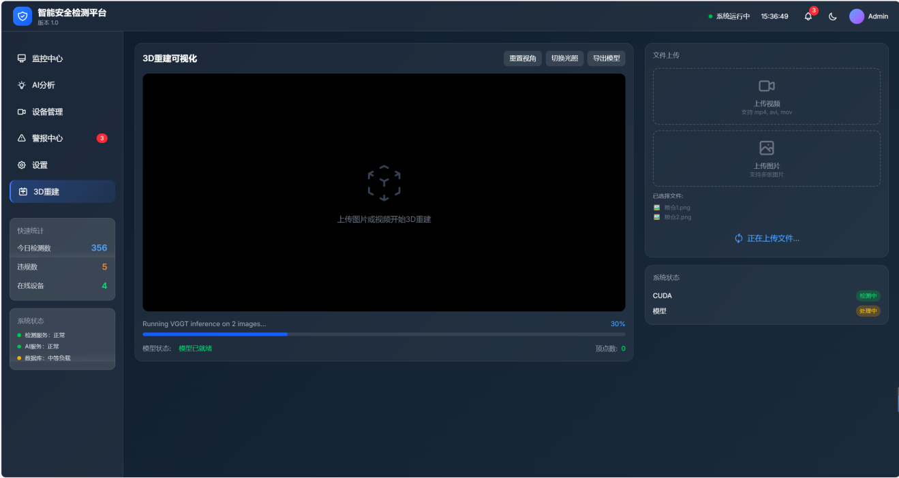
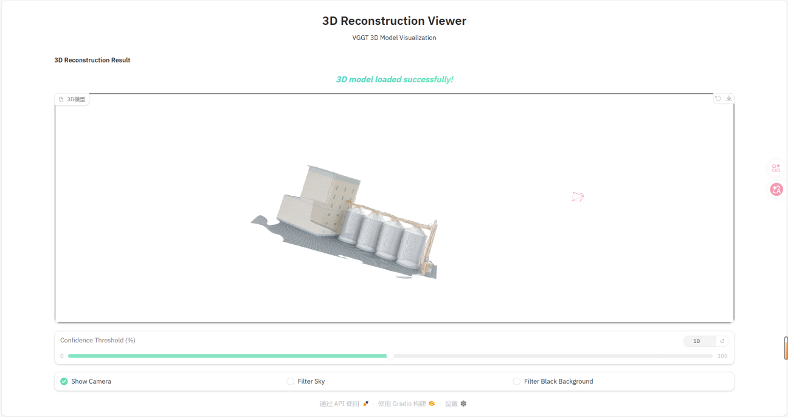

# 基于DCCP-YOLO的粮仓防护设备检测系统

## 1. 项目概述

### 1.1 项目背景
随着粮食仓储安全管理需求的不断增长，智能化监控系统在粮仓安全管理领域发挥着越来越重要的作用。传统的粮仓监控主要依赖人工巡检，存在效率低、漏检率高、响应慢等问题。本系统基于改进的DCCP-YOLO深度学习算法，实现了粮仓防护设备（安全帽、呼吸器等）的智能检测，并结合温湿度传感器、AI大模型分析等技术，构建了一套完整的粮仓安全智能监控平台。

### 1.2 核心技术
- **DCCP-YOLO算法**：在YOLOv8基础上引入IGAB（Improved Global Attention Block）注意力机制模块，提升检测精度
- **多模态融合**：集成视频检测、环境监测、AI分析等多种功能
- **边缘计算支持**：支持Jetson Orin Nano边缘设备部署
- **3D场景重建**：基于VGGT模型实现粮仓场景三维重建

## 2. 系统架构

### 2.1 整体架构
```
┌─────────────────────────────────────────────────────────────────────────────────┐
│                        Web 前端层（Django Templates + Tailwind CSS）             │
│  ┌─────────────┐  ┌─────────────┐  ┌─────────────┐  ┌─────────┐  ┌───────────┐ │
│  │ 视频检测区  │  │ 模型配置区  │  │ AI分析面板  │  │ 告警区  │  │ 传感器面板│ │
│  └─────────────┘  └─────────────┘  └─────────────┘  └─────────┘  └───────────┘ │
│  ┌───────────────────────────────────────────────────────────────────────────┐ │
│  │                         设备管理区 & 3D重建模块                            │ │
│  └───────────────────────────────────────────────────────────────────────────┘ │
└─────────────────────────────────────────────────────────────────────────────────┘
                                                │
┌─────────────────────────────────────────────────────────────────────────────────┐
│                        Django 后端层                                            │
│  ┌─────────────┐  ┌─────────────┐  ┌─────────────┐  ┌─────────┐  ┌───────────┐ │
│  │ 视频处理模块│  │DCCP-YOLO检测│  │ 模型管理模块│  │ 告警模块│  │ 传感器模块│ │
│  └─────────────┘  └─────────────┘  └─────────────┘  └─────────┘  └───────────┘ │
│  ┌─────────────┐  ┌─────────────┐  ┌─────────────┐                              │
│  │DeepSeek AI  │  │微信公众号   │  │VGGT 3D重建 │                              │
│  └─────────────┘  └─────────────┘  └─────────────┘                              │
└─────────────────────────────────────────────────────────────────────────────────┘
                                                │
┌─────────────────────────────────────────────────────────────────────────────────┐
│                        底层支持层                                                │
│  ┌─────────────┐  ┌─────────────┐  ┌─────────────┐  ┌─────────┐  ┌───────────┐ │
│  │ OpenCV      │  │ CUDA 加速   │  │ PyTorch     │  │ SQLite  │  │ Gradio    │ │
│  └─────────────┘  └─────────────┘  └─────────────┘  └─────────┘  └───────────┘ │
│  ┌─────────────┐  ┌─────────────┐                                                │
│  │Jetson Orin  │  │温湿度传感器 │                                                │
│  └─────────────┘  └─────────────┘                                                │
└─────────────────────────────────────────────────────────────────────────────────┘
```

## 3. 技术栈

| 分类 | 技术/框架 | 版本 | 用途 |
|------|----------|------|------|
| 后端框架 | Django | 4.2.27 | Web应用框架 |
| 深度学习模型 | DCCP-YOLO (基于YOLOv8) | - | 目标检测 |
| 3D重建模型 | VGGT | 最新版 | 3D场景重建 |
| AI大模型 | DeepSeek | - | 智能分析建议 |
| 视频处理 | OpenCV | 最新版 | 视频流处理 |
| 前端框架 | HTML5 + CSS3 + JavaScript | - | 前端界面 |
| 样式库 | Tailwind CSS | 4.x | 响应式设计 |
| 加速计算 | CUDA | 11.8+ | GPU加速 |
| 数据库 | SQLite | 内置 | 数据存储 |
| 开发语言 | Python | 3.10+ | 后端开发 |
| 3D可视化 | Gradio + Three.js | 最新版 | 3D模型渲染 |
| 深度学习框架 | PyTorch | - | 模型推理 |

## 4. 项目目录结构

```
Django-YOLO-detection-system-main/
├── detection/                     # 检测应用
│   ├── migrations/                # 数据库迁移文件
│   ├── static/                    # 静态文件
│   │   ├── media/                 # 媒体文件
│   │   ├── models/                # YOLO模型文件
│   │   │   ├── yolov8-best.pt     # 训练后的最佳模型
│   │   │   └── yolov8-init.pt     # 初始模型
│   │   └── vggt_output/           # VGGT 3D模型输出
│   ├── templates/                 # HTML模板
│   │   ├── index.html             # 主页面模板
│   │   └── image_result.html      # 图片检测结果模板
│   ├── ultralytics/               # 本地ultralytics库（含IGAB模块）
│   ├── __init__.py
│   ├── admin.py
│   ├── apps.py
│   ├── config.json                # 系统配置文件
│   ├── gradio_server.py           # Gradio 3D渲染服务器
│   ├── models.py
│   ├── urls.py                    # API路由配置
│   ├── views.py                   # 视图函数（核心业务逻辑）
│   ├── vggt_processor.py          # VGGT 3D重建处理
│   ├── wxgzh.py                   # 微信公众号推送
│   └── yolo_detector.py           # YOLO检测封装
├── ultralytics/                   # 项目级ultralytics库
│   └── cfg/models/v8/
│       └── yolov8-IGAB.yaml       # DCCP-YOLO模型配置
├── vggt/                          # VGGT模型库
│   ├── model.pt                   # VGGT预训练模型
│   ├── vggt/                      # VGGT核心代码
│   └── visual_util.py             # 3D可视化工具
├── yolosecurity/                  # Django项目配置
│   ├── settings.py
│   ├── urls.py
│   └── wsgi.py
├── images/                        # README截图
├── deepseek.py                    # DeepSeek AI接口
├── manage.py                      # Django管理脚本
├── requirements.txt               # 依赖列表
└── db.sqlite3                     # SQLite数据库
```

## 5. 安装部署指南

### 5.1 环境要求
- **操作系统**：Windows 10/11，Ubuntu 20.04+
- **Python版本**：3.10+
- **CUDA版本**：11.8+（可选，用于GPU加速）
- **内存**：8GB+
- **磁盘空间**：20GB+

### 5.2 依赖安装步骤

1. **克隆项目**
   ```bash
   git clone git@github.com:wuqi789/Django-YOLO-detection-system.git
   cd Django-YOLO-detection-system-main
   ```

2. **创建虚拟环境**
   ```bash
   python -m venv venv
   # Windows
   venv\Scripts\activate
   # Linux/macOS
   source venv/bin/activate
   ```

3. **安装Python依赖**
   ```bash
   pip install -r requirements.txt
   ```

4. **下载VGGT模型文件**
   - 由于模型文件较大，未包含在GitHub仓库中
   - 请从以下链接下载：
     - 夸克网盘：https://pan.quark.cn/s/b7ed453f0f3f（提取码：mAHM）
     - HuggingFace：https://huggingface.co/facebook/VGGT-1B/blob/main/model.pt
   - 下载后将 `model.pt` 文件放置到 `vggt/` 目录下

5. **验证安装**
   ```bash
   # 检查Django版本
   python -m django --version
   
   # 检查YOLOv8安装
   python -c "from ultralytics import YOLO; print('YOLOv8 installed successfully')"
   
   # 检查VGGT模型文件
   python -c "import os; print('VGGT model exists' if os.path.exists('vggt/model.pt') else 'VGGT model not found')"
   ```

### 5.3 配置说明

1. **系统配置**（config.json）
   ```json
   {
       "jetson_ip": "192.168.0.111",
       "batch_size": 1
   }
   ```

2. **模型配置**
   - YOLO模型文件放置在 `detection/static/models/` 目录
   - 支持 `.pt` 格式的YOLOv8模型

3. **微信公众号配置**（wxgzh.py）
   ```python
   APPID = 'your_appid'
   APPSECRET = 'your_appsecret'
   openids = ["user_openid"]
   ```

4. **AI模型配置**（deepseek.py）
   ```python
   OPENROUTER_API_KEY = "your_api_key"
   ```

## 6. 运行与测试

### 6.1 开发环境启动

1. **初始化数据库**
   ```bash
   python manage.py migrate
   ```

2. **创建超级用户（可选）**
   ```bash
   python manage.py createsuperuser
   ```

3. **启动开发服务器**
   ```bash
   python manage.py runserver
   ```

4. **访问应用**
   - 打开浏览器，访问 `http://127.0.0.1:8000/`

### 6.2 功能使用说明

1. **视频检测**
   - 选择视频源（摄像头/本地文件/Jetson设备）
   - 点击「开始检测」按钮
   - 实时查看检测结果和统计信息

2. **图片检测**
   - 选择「本地图片」作为视频源
   - 上传单张或多张图片
   - 查看检测结果

3. **AI分析**
   - 切换到「AI分析」标签页
   - 点击「获取AI建议」
   - 查看环境分析和风险等级

4. **3D重建**
   - 切换到「3D重建」标签页
   - 上传图片或视频文件
   - 点击「开始重建」
   - 完成后访问 `http://localhost:8080` 查看3D模型

5. **设备管理**
   - 切换到「设备管理」标签页
   - 查看摄像头在线状态
   - 控制摄像头开关

## 7. API接口说明

### 7.1 检测相关接口

| 接口 | 方法 | 说明 |
|------|------|------|
| `/detect/` | POST | 执行检测 |
| `/detect_frame/` | POST | 单帧检测 |
| `/detect_image/` | POST | 图片检测 |
| `/process_video/` | POST | 视频处理 |
| `/process_progress/` | GET | 获取处理进度 |

### 7.2 模型管理接口

| 接口 | 方法 | 说明 |
|------|------|------|
| `/get_models/` | GET | 获取模型列表 |
| `/switch_model/` | POST | 切换模型 |
| `/get_current_model/` | GET | 获取当前模型 |

### 7.3 传感器接口

| 接口 | 方法 | 说明 |
|------|------|------|
| `/get_sensors/` | GET | 获取传感器数据 |
| `/get_stats/` | GET | 获取统计数据 |

### 7.4 AI分析接口

| 接口 | 方法 | 说明 |
|------|------|------|
| `/get_ai_analysis/` | GET | 获取AI分析建议 |
| `/export_ai_pdf/` | POST | 导出AI分析PDF报告 |

### 7.5 3D重建接口

| 接口 | 方法 | 说明 |
|------|------|------|
| `/vggt_preload_model/` | POST | 预加载VGGT模型 |
| `/vggt_reconstruct/` | POST | 开始3D重建 |
| `/vggt_status/` | GET | 获取重建状态 |
| `/vggt_export/` | POST | 导出3D模型 |

### 7.6 设备管理接口

| 接口 | 方法 | 说明 |
|------|------|------|
| `/get_camera_status/` | GET | 获取摄像头状态 |
| `/control_camera/` | POST | 控制摄像头 |
| `/start_jetson_stream/` | POST | 启动Jetson视频流 |
| `/stop_jetson_stream/` | POST | 停止Jetson视频流 |

## 8. 运行截图










## 9. 常见问题解决方案

### 9.1 无法访问摄像头
- 检查浏览器是否允许摄像头权限
- 确保摄像头未被其他应用占用
- 检查摄像头驱动是否正常

### 9.2 检测速度慢
- 确保已安装CUDA并配置正确
- 降低检测分辨率
- 使用更小的YOLOv8模型

### 9.3 Jetson设备连接失败
- 检查Jetson设备IP配置是否正确
- 确保Jetson设备上的视频服务正在运行
- 检查网络连接状态

### 9.4 3D重建失败
- 确保VGGT模型文件存在
- 检查GPU内存是否充足（建议8GB+）
- 尝试减少输入图片数量

### 9.5 AI分析返回错误
- 检查OpenRouter API配置
- 确认API密钥有效
- 检查网络连接

## 10. 联系方式

如有任何问题或建议，欢迎通过以下方式联系我们：
- 邮件：wuqi173@outlook.com

## 11. 版本更新日志

- **v1.0.0**：初始版本，支持基本的视频检测功能
- **v1.1.0**：添加模型管理功能，支持模型切换
- **v1.2.0**：优化检测进度显示，添加本地视频支持
- **v1.3.0**：添加告警功能，支持告警阈值配置
- **v1.4.0**：优化前端界面，使用Tailwind CSS重构
- **v1.5.0**：添加CUDA加速支持，提高检测速度
- **v1.6.0**：集成温湿度传感器，实现实时数据显示
- **v1.7.0**：添加DeepSeek AI大模型集成，提供智能建议
- **v1.8.0**：添加微信公众号消息推送功能
- **v1.9.0**：添加Jetson Orin Nano边缘设备支持
- **v2.0.0**：引入DCCP-YOLO算法，集成IGAB注意力模块
- **v2.1.0**：添加VGGT 3D重建功能
- **v2.2.0**：优化AI分析PDF报告生成
- **v2.3.0**：完善设备管理模块，支持多摄像头管理

---

**版本**：v2.3.0  
**更新日期**：2026-02-28  
**开发者**：吴棋(wuqi)
