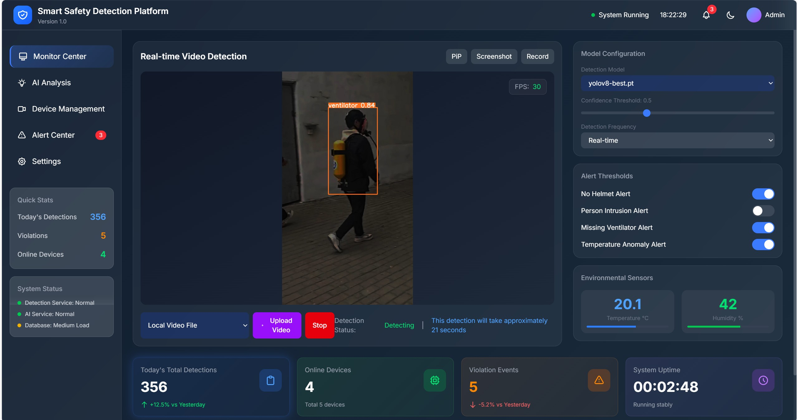
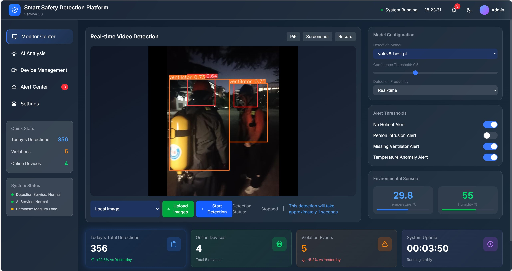
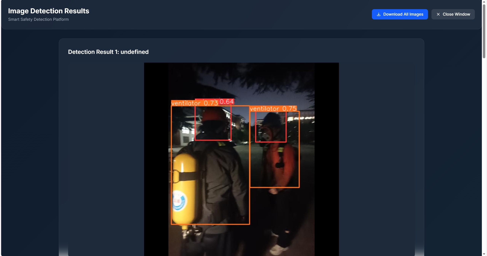
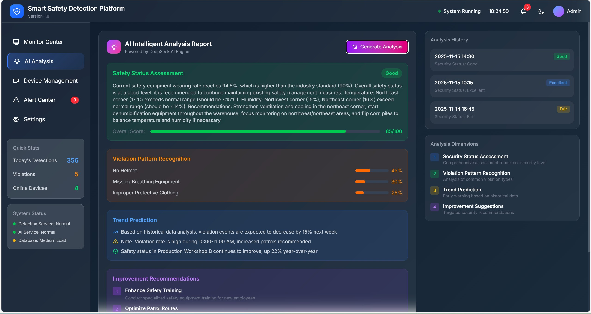
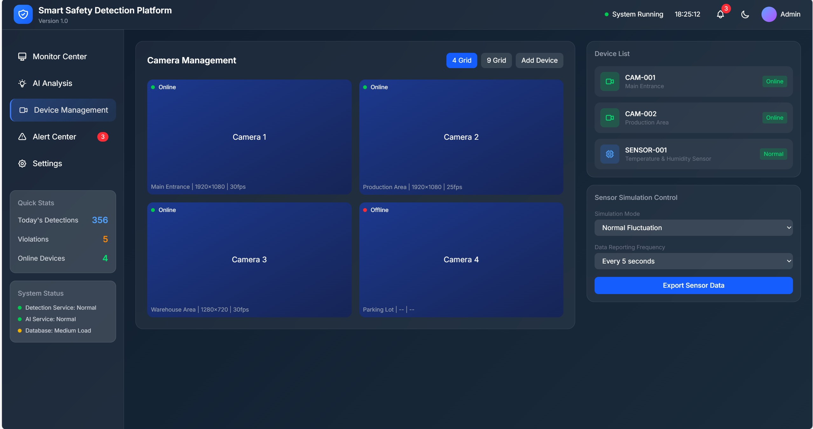
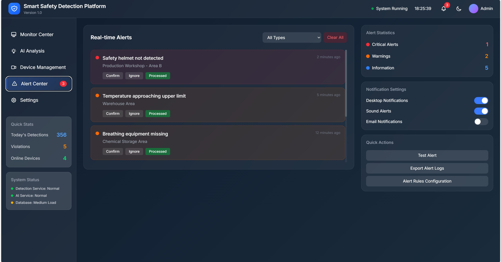
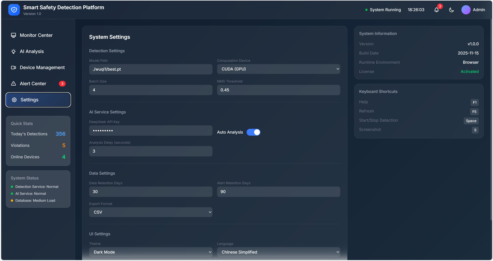

# Django-YOLO 实时视频与图片检测系统
## 1. 项目概述

### 1 项目背景
随着工业自动化和智能监控需求的不断增长，实时视频检测系统在安全生产、人员管理、环境监测等领域发挥着越来越重要的作用。传统的视频监控系统主要依赖人工值守，存在效率低、漏报率高、响应慢等问题。基于深度学习的实时视频检测系统能够自动识别视频中的目标对象，实时告警，大大提高了监控效率和准确性。
## 2. 核心功能模块

### 2.1 系统架构
```
┌─────────────────────────────────────────────────────────────────────────────────┐
│                        Web 前端层                                              │
│  ┌─────────────┐  ┌─────────────┐  ┌─────────────┐  ┌─────────┐  ┌───────────┐ │
│  │ 视频播放区  │  │ 检测控制区  │  │ 模型配置区  │  │ 告警区  │  │ 传感器面板│ │
│  └─────────────┘  └─────────────┘  └─────────────┘  └─────────┘  └───────────┘ │
│  ┌───────────────────────────────────────────────────────────────────────────┐ │
│  │                              AI建议面板                                   │ │
│  └───────────────────────────────────────────────────────────────────────────┘ │
│  ┌───────────────────────────────────────────────────────────────────────────┐ │
│  │                              设备管理区                                   │ │
│  └───────────────────────────────────────────────────────────────────────────┘ │
└─────────────────────────────────────────────────────────────────────────────────┘
                                                │
┌─────────────────────────────────────────────────────────────────────────────────┐
│                        Django 后端层                                         │
│  ┌─────────────┐  ┌─────────────┐  ┌─────────────┐  ┌─────────┐  ┌───────────┐ │
│  │ 视频处理模块│  │ YOLO 检测模块│  │ 模型管理模块│  │ 告警模块│  │ 传感器模块│ │
│  └─────────────┘  └─────────────┘  └─────────────┘  └─────────┘  └───────────┘ │
│  ┌───────────────────────────────────────────────────────────────────────────┐ │
│  │                            AI大模型集成模块                              │ │
│  └───────────────────────────────────────────────────────────────────────────┘ │
│  ┌───────────────────────────────────────────────────────────────────────────┐ │
│  │                            设备管理模块                                    │ │
│  └───────────────────────────────────────────────────────────────────────────┘ │
└─────────────────────────────────────────────────────────────────────────────────┘
                                                │
┌─────────────────────────────────────────────────────────────────────────────────┐
│                        底层支持层                                              │
│  ┌─────────────┐  ┌─────────────┐  ┌─────────────┐  ┌─────────┐  ┌───────────┐ │
│  │ 媒体处理库  │  │ CUDA 加速   │  │ 文件存储    │  │ 日志系统│  │ 传感器硬件│ │
│  │ (OpenCV)    │  │             │  │             │  │         │  │           │ │
│  └─────────────┘  └─────────────┘  └─────────────┘  └─────────┘  └───────────┘ │
│  ┌───────────────────────────────────────────────────────────────────────────┐ │
│  │                                摄像头设备                                   │ │
│  └───────────────────────────────────────────────────────────────────────────┘ │
└─────────────────────────────────────────────────────────────────────────────────┘
```

### 2.2 核心功能模块

#### 2.2.1 视频检测模块
- **功能描述**：支持本地视频文件和摄像头实时检测，实现人员、头盔、呼吸机等目标的精确检测
- **技术实现**：基于 YOLOv8 模型，使用 CUDA 加速检测
- **流程**：
  1. 获取视频流或本地视频文件
  2. 逐帧处理视频
  3. 使用 YOLOv8 模型进行目标检测
  4. 绘制检测框和标签
  5. 显示检测结果

#### 2.2.2 模型管理模块
- **功能描述**：管理 YOLO 模型，支持模型切换和参数配置
- **技术实现**：Django 后端提供模型管理 API
- **流程**：
  1. 加载可用模型列表
  2. 显示模型信息（名称、大小）
  3. 支持模型切换
  4. 配置检测参数（置信度、检测频率）

#### 2.2.3 检测控制模块
- **功能描述**：控制检测流程，包括开始/停止检测、选择视频源
- **技术实现**：JavaScript 前端控制，Django 后端处理
- **流程**：
  1. 选择视频源（摄像头或本地文件）
  2. 点击开始检测按钮
  3. 启动检测流程
  4. 实时显示检测状态和进度
  5. 点击停止按钮结束检测

#### 2.2.4 告警模块
- **功能描述**：根据检测结果生成告警，支持告警阈值配置
- **技术实现**：前端显示告警列表，后端处理告警逻辑
- **流程**：
  1. 检测到违规行为
  2. 生成告警信息
  3. 显示告警列表
  4. 支持告警阈值配置

#### 2.2.5 温湿度传感器模块
- **功能描述**：实时采集和显示三个温湿度传感器的单独数据，支持传感器状态监控
- **技术实现**：
  - 前端：实时数据展示面板，显示三个传感器的温度和湿度数值
  - 后端：传感器数据采集和处理API，返回三个传感器的原始数值
- **流程**：
  1. 三个传感器分别采集温湿度数据
  2. 后端接收并处理数据，确保返回每个传感器的原始数值
  3. 前端实时更新显示，每1000毫秒刷新一次
  4. 支持传感器异常告警，包括高温度告警
  5. 温湿度数据显示两位小数，提供更精确的数值参考
  6. 使用异步请求和请求取消机制，确保高频数据获取不阻塞页面
  7. 实现数据获取失败时的降级处理，确保系统稳定性

#### 2.2.6 设备管理模块
- **功能描述**：管理系统中的摄像头设备，包括摄像头状态检测、实时预览和控制功能
- **技术实现**：
  - 前端：设备管理页面，显示四个摄像头的状态和控制按钮
  - 后端：使用OpenCV检测实际连接的摄像头数量，提供摄像头状态和控制API
- **流程**：
  1. 后端使用OpenCV检测实际连接的摄像头数量
  2. 前端每500毫秒从后端获取最新的摄像头状态
  3. 当成功检测到摄像头时，显示"打开摄像头"和"停止"两个按钮
  4. 点击"打开摄像头"按钮，启动对应摄像头的实时预览功能
  5. 点击"停止"按钮，停止当前摄像头的预览功能
  6. 当未检测到对应摄像头时，清晰显示该摄像头的未连接状态

#### 2.2.6 AI大模型集成模块
- **功能描述**：集成AI大模型，提供智能分析和建议
- **技术实现**：
  - 前端：AI建议面板，显示智能分析结果
  - 后端：与AI大模型API集成，处理分析请求
- **流程**：
  1. 收集检测数据和传感器数据
  2. 发送到AI大模型进行分析
  3. 接收AI生成的建议和分析
  4. 前端展示AI建议
- **智能建议类型**：
  - 安全风险评估
  - 设备维护建议
  - 异常行为预测
  - 优化检测参数建议

#### 2.2.7 设备管理模块
- **功能描述**：管理和监控系统中的摄像头设备，支持摄像头状态检测、实时预览和控制
- **技术实现**：
  - 前端：设备管理面板，显示摄像头状态和控制按钮
  - 后端：使用OpenCV检测实际摄像头数量，提供摄像头控制API
- **流程**：
  1. 系统启动时自动检测可用摄像头数量
  2. 前端动态显示摄像头状态（在线/离线）
  3. 在线摄像头显示控制按钮（打开摄像头/停止）
  4. 支持摄像头实时预览和检测控制
  5. 自动适配实际摄像头数量，动态调整UI显示
- **核心功能**：
  - 摄像头自动检测（基于OpenCV）
  - 摄像头状态实时监控
  - 摄像头开关控制
  - 摄像头实时预览
  - 检测结果实时显示

## 3. 技术栈选型与架构设计

### 3.1 技术栈选型
| 分类 | 技术/框架 | 版本 | 用途 |
|------|----------|------|------|
| 后端框架 | Django | 4.2.27 | Web 应用框架，提供 API 接口 |
| 深度学习模型 | YOLOv8 | 最新版 | 目标检测 |
| 视频处理 | OpenCV | 最新版 | 视频流处理、帧提取 |
| 前端框架 | HTML5 + CSS3 + JavaScript | 最新 | 前端界面开发 |
| 样式库 | Tailwind CSS | 最新 | 响应式样式设计 |
| 加速计算 | CUDA | 11.8+ | GPU 加速检测 |
| 数据库 | SQLite | 内置 | 项目配置存储 |
| 开发语言 | Python | 3.10+ | 后端开发 |
| 传感器集成 | 自定义传感器模块 | 最新 | 温湿度数据采集和处理 |
| AI大模型 | 大模型API | 最新 | 智能分析和建议生成 |
| 数据可视化 | Chart.js | 最新 | 温湿度数据仪表盘 |

### 3.2 架构设计
- **前后端分离架构**：前端负责界面展示和用户交互，后端负责业务逻辑和模型处理
- **模块化设计**：功能模块清晰分离，便于扩展和维护
- **异步处理**：视频检测采用异步处理，避免阻塞主线程
- **实时通信**：前端通过轮询或 WebSocket 获取检测结果
### 3.3 运行截图
 
 
 
 
 
 
 
## 4. 安装部署指南

### 4.1 环境要求
- **操作系统**：Windows 10/11，Ubuntu 20.04+
- **Python 版本**：3.10+
- **CUDA 版本**：11.8+（可选，用于 GPU 加速）
- **内存**：8GB+
- **磁盘空间**：20GB+

### 4.2 依赖安装步骤
1. **克隆项目**
   ```bash
   git clone git@github.com:wuqi789/Django-YOLO-detection-system.git
   cd yolosecurity
   ```

2. **创建虚拟环境**
   ```bash
   python -m venv venv
   # Windows
   venv\Scripts\activate
   # Linux/macOS
   source venv/bin/activate
   ```

3. **安装 Python 依赖**
   ```bash
   pip install -r requirements.txt
   ```

4. **验证安装**
   ```bash
   # 检查 Django 版本
   python -m django --version
   
   # 检查 YOLOv8 安装
   python -c "from ultralytics import YOLO; print('YOLOv8 installed successfully')"
   ```

5. **安装 CUDA 支持（可选）**
   - 安装 CUDA Toolkit 11.8
   - 安装 cuDNN 8.9+
   - 验证 CUDA 安装：
     ```bash
     python -c "import torch; print(torch.cuda.is_available())"
     ```

### 4.3 配置说明
1. **项目配置**
   - 修改 `yolosecurity/settings.py` 中的配置：
     ```python
     # 媒体文件配置
     MEDIA_URL = '/media/'
     MEDIA_ROOT = BASE_DIR / 'media'
     
     # 静态文件配置
     STATIC_URL = '/static/'
     STATICFILES_DIRS = [
         BASE_DIR / 'static'
     ]
     ```

2. **模型配置**
   - 将 YOLOv8 模型文件放置在 `detection/static/models/` 目录下
   - 支持 `.pt` 格式的 YOLOv8 模型

3. **数据库配置**
   - 默认使用 SQLite 数据库，无需额外配置
   - 如需使用 MySQL 或 PostgreSQL，请修改 `settings.py` 中的数据库配置

## 5. 运行与测试方法

### 5.1 开发环境启动
1. **初始化数据库**
   ```bash
   python manage.py migrate
   ```

2. **创建超级用户（可选）**
   ```bash
   python manage.py createsuperuser
   ```

3. **启动开发服务器**
   ```bash
   python manage.py runserver
   ```

4. **访问应用**
   - 打开浏览器，访问 `http://127.0.0.1:8000/`

### 5.2 生产环境部署
1. **收集静态文件**
   ```bash
   python manage.py collectstatic
   ```

2. **使用 Gunicorn 启动**
   ```bash
   gunicorn yolosecurity.wsgi:application --bind 0.0.0.0:8000
   ```

3. **配置 Nginx 代理（可选）**
   - 安装 Nginx
   - 配置 Nginx 代理到 Gunicorn
   - 配置 SSL 证书（可选）

### 5.3 常用操作示例
1. **选择视频源**
   - 在界面上方的视频源选择下拉菜单中选择：
     - 摄像头 1 - 主入口
     - 摄像头 2 - 生产车间
     - 摄像头 3 - 仓库区域
     - 本地视频文件

2. **开始/停止检测**
   - 点击「开始检测」按钮启动检测
   - 点击「停止」按钮结束检测

3. **调整检测参数**
   - 调整置信度阈值滑块（0.3-0.9）
   - 选择检测频率（实时）
   - 配置告警阈值

4. **查看检测结果**
   - 检测结果实时显示在视频上
   - 检测统计信息显示在左上角
   - 告警信息显示在右侧告警列表

5. **设备管理与摄像头控制**
   - **查看摄像头状态**：设备管理区会自动显示检测到的摄像头数量和状态（在线/离线）
   - **打开摄像头**：点击在线摄像头下方的「打开摄像头」按钮，启动摄像头实时预览
   - **停止摄像头**：点击摄像头下方的「停止」按钮，结束摄像头预览
   - **摄像头自适应**：系统会根据实际检测到的摄像头数量，自动调整UI显示
   - **温湿度传感器监控**：传感器面板实时显示三个传感器的温湿度数据，每500毫秒更新一次

## 6. 项目目录结构说明

```
yolosecurity/
├── detection/                 # 检测应用
│   ├── migrations/            # 数据库迁移文件
│   ├── static/                # 静态文件
│   │   ├── media/             # 媒体文件
│   │   └── models/            # YOLO 模型文件
│   ├── media/                 # 媒体文件存储
│   ├── templates/             # HTML 模板
│   │   ├── index.html         # 主页面模板
│   │   └── image_result.html  # 图片检测结果模板
│   ├── ultralytics/           # 本地 ultralytics 库
│   ├── __init__.py            # 应用初始化文件
│   ├── admin.py               # 后台管理配置
│   ├── apps.py                # 应用配置
│   ├── models.py              # 数据模型
│   ├── tests.py               # 测试文件
│   ├── urls.py                # 应用路由
│   ├── views.py               # 视图函数
│   └── yolo_detector.py       # YOLO检测封装
├── ultralytics/               # 本地 ultralytics 库
├── media/                     # 媒体文件存储
├── static/                    # 收集的静态文件
├── manage.py                  # 项目管理脚本
├── requirements.txt           # 依赖列表
└── db.sqlite3                 # SQLite 数据库
```

## 7. 关键功能实现解析

### 7.1 视频检测流程
1. **视频源选择**
   - 前端 JavaScript 处理视频源选择事件
   - 摄像头：请求摄像头权限，获取媒体流
   - 本地文件：打开文件选择对话框，读取文件

2. **检测启动**
   - 点击开始检测按钮
   - 前端发送检测请求到后端
   - 后端启动检测进程
   - 实时返回检测结果

3. **帧处理与检测**
   - 提取视频帧
   - 转换为模型输入格式
   - 使用 YOLOv8 模型检测
   - 处理检测结果
   - 绘制检测框和标签

4. **检测结果展示**
   - 实时显示检测视频
   - 显示检测统计信息
   - 生成告警信息

### 7.2 模型加载与切换
1. **模型加载**
   - 页面加载时调用 `loadModels()` 函数
   - 后端 API 返回可用模型列表
   - 前端动态生成模型选择下拉菜单
   - 设置第一个模型为默认值

2. **模型切换**
   - 选择新的模型
   - 前端发送模型切换请求到后端
   - 后端加载新模型
   - 更新检测结果

### 7.3 检测进度显示
1. **本地视频检测**
   - 获取视频时长
   - 显示检测时间估计
   - 检测过程中显示处理弹窗
   - 检测完成后自动播放视频

2. **摄像头实时检测**
   - 显示检测状态
   - 实时更新检测统计
   - 无进度条，持续检测

### 7.4 温湿度传感器前端显示
1. **数据采集**
   - 三个传感器分别实时采集温湿度数据
   - 后端通过API接口提供每个传感器的原始数值
   - 每500毫秒更新一次数据，确保实时性

2. **前端显示**
   - 实时更新的三个传感器数据面板
   - 每个传感器显示独立的温度和湿度数值（两位小数）
   - 每个传感器配有温度和湿度进度条，直观显示数值变化
   - 传感器状态和时间戳显示
   - 异常状态告警，包括高温度告警

3. **实现细节**
   - 每500毫秒从后端获取最新数据
   - 使用AbortController确保不会有多个同时的请求
   - 当API请求失败时，生成模拟数据作为fallback
   - 批量更新DOM元素，优化性能
   - 高温度告警功能，避免频繁告警
   - 温湿度数据显示两位小数，提供更精确的数值参考

### 7.5 AI大模型实时建议
1. **数据收集**
   - 收集视频检测结果
   - 整合温湿度传感器数据
   - 汇总告警信息

2. **AI分析**
   - 将数据发送到AI大模型
   - 接收AI生成的分析报告
   - 提取关键建议和洞察

3. **前端展示**
   - 智能建议面板
   - 风险评估结果
   - 优化建议
   - 预测性分析

4. **实现细节**
   - 定期调用AI大模型API
   - 缓存分析结果，减少API调用
   - 支持手动刷新建议
   - 建议分级显示（高、中、低优先级）

### 7.6 单(多)张图片检测流程
1. **图片上传**
   - 选择本地图片文件
   - 点击开始检测按钮

2. **检测处理**
   - 前端发送图片到后端
   - 后端使用 YOLOv8 模型进行检测
   - 直接生成带标注的图片
   - 返回 Base64 编码的检测结果图片

3. **结果显示**
   - 在当前页面实时显示检测结果
   - 不跳转新标签页(多张图片则跳转)
   - 显示检测统计信息
   - 图片上直接显示检测框和标签

### 7.7 Jetson Orin Nano 支持
1. **功能描述**
   - 支持 Jetson Orin Nano 设备接入
   - 实时视频流获取与检测
   - 远程设备管理

2. **技术实现**
   - 后端线程实时捕获 Jetson 视频流
   - 提供 Jetson 设备专用 API
   - 支持 Jetson IP 地址配置

3. **使用方法**
   - 在设置页面配置 Jetson Orin Nano IP 地址
   - 在视频源选择中选择 "Jetson Orin Nano"
   - 点击 "Open" 按钮开始查看 Jetson 视频流

4. **实现细节**
   - 使用线程持续捕获 Jetson 视频帧
   - 提供 `start_jetson_stream`、`stop_jetson_stream` 和 `get_jetson_frame` API
   - 支持 Jetson IP 地址动态配置
   - 实时视频流检测，延迟低

### 7.8 置信度阈值调整
1. **功能描述**
   - 支持实时调整检测置信度阈值
   - 影响所有检测类型（视频、图片、Jetson流）
   - 直观的滑块控制

2. **技术实现**
   - 前端滑块组件实时更新置信度值
   - 后端验证并设置置信度阈值
   - 检测器实例统一使用最新置信度值

3. **使用方法**
   - 在模型配置区域拖动置信度滑块（0.3-0.9）
   - 所有后续检测自动使用新的置信度值
   - 实时显示当前置信度数值

4. **实现细节**
   - 置信度值范围验证（0.3-0.9）
   - 完整的日志记录便于调试
   - 所有检测方法统一使用置信度值
   - 实时生效，无需重启服务

## 8. 常见问题解决方案

### 8.1 问题：无法访问摄像头
**解决方案**：
- 检查浏览器是否允许摄像头权限
- 确保摄像头未被其他应用占用
- 检查摄像头驱动是否正常

### 8.2 问题：检测速度慢
**解决方案**：
- 确保已安装 CUDA 并配置正确
- 降低检测分辨率
- 调整检测频率
- 使用更小的 YOLOv8 模型（如 yolov8n.pt）

### 8.3 问题：检测结果不准确
**解决方案**：
- 调整置信度阈值
- 使用更精确的 YOLOv8 模型（如 yolov8l.pt 或 yolov8x.pt）
- 对模型进行微调
- 确保视频质量良好

### 8.4 问题：模型加载失败
**解决方案**：
- 检查模型文件是否存在于正确目录
- 确保模型文件格式正确（.pt 格式）
- 检查模型文件名是否包含特殊字符
- 查看服务器日志获取详细错误信息

### 8.5 问题：本地视频无法播放
**解决方案**：
- 检查视频格式是否支持（MP4 格式最佳）
- 确保视频文件未损坏
- 检查浏览器是否支持 HTML5 视频播放
- 查看浏览器控制台获取详细错误信息

## 9. 联系方式

如有任何问题或建议，欢迎通过以下方式联系我们：
- 邮件：wuqi173@outlook.com

## 10. 附录

### 10.1 检测目标类别
本系统支持检测以下目标类别：
- 人员（person）
- 头盔（helmet）
- 呼吸机（ventilator）

### 10.2 配置文件说明
- `settings.py`：Django 项目配置
- `urls.py`：路由配置
- `views.py`：视图函数，处理业务逻辑
- `index.html`：前端主页面模板

### 10.3 开发规范
- 代码风格遵循 PEP 8 规范
- 前端代码使用 ES6+ 语法
- 提交代码前运行测试
- 编写详细的代码注释

### 10.4 版本更新日志
- **v1.0.0**：初始版本，支持基本的视频检测功能
- **v1.1.0**：添加模型管理功能，支持模型切换
- **v1.2.0**：优化检测进度显示，添加本地视频支持
- **v1.3.0**：添加告警功能，支持告警阈值配置
- **v1.4.0**：优化前端界面，使用 Tailwind CSS 重构
- **v1.5.0**：添加 CUDA 加速支持，提高检测速度
- **v1.6.0**：集成温湿度传感器，实现实时数据显示
- **v1.7.0**：添加AI大模型集成，提供智能建议和分析
- **v1.8.0**：优化传感器数据可视化，添加趋势图显示
- **v1.9.0**：增强AI建议功能，支持多种建议类型
- **v2.0.0**：
  - 优化单张图片检测功能，直接在当前页面显示检测结果
  - 添加实时摄像头检测优化，使用后端直接生成带标注的图片
  - 优化前端显示逻辑，确保检测结果与视频流高度同步
  - 调整检测参数，降低延迟，提高实时性
  - 优化视频检测流程，直接生成带标注的图片
  - 优化温湿度传感器模块，支持三个传感器的单独数据显示
  - 增强传感器数据处理，确保返回每个传感器的原始数值
  - 优化传感器数据获取机制，添加请求取消和fallback机制
- **v2.1.0**：
  - 优化传感器数据更新频率，从1000ms提升至500ms，实现更实时的数据显示
  - 添加设备管理模块，支持摄像头状态检测和控制
  - 使用OpenCV自动检测实际摄像头数量，实现自适应显示
  - 优化前端UI，移除不必要的"Environmental Sensors"和"Detection Frequency"部分
  - 优化设备管理界面，移除9 Grid和Add Device按钮
  - 实现摄像头实时控制功能，支持打开/停止摄像头预览
  - 移除摄像头控制中的"检测"按钮，简化操作流程
  - 优化README.md文档，确保信息准确性和完整性

- **v2.2.0**：
  - 添加 Jetson Orin Nano 支持，实现远程视频流获取与检测
  - 优化设备管理界面，将打开/停止按钮合并为切换按钮
  - 移除设备管理界面右上角的类别显示
  - 添加 Jetson Orin Nano IP 配置功能到系统设置
  - 修复摄像头索引超出范围错误
  - 改进置信度阈值处理机制，确保所有检测统一使用最新置信度
  - 优化AI建议格式，从Markdown转换为纯文本，适合微信公众号发送
  - 改进保存设置提示，使用浏览器弹窗明确提示"已保存"
  - 增强日志记录，便于调试和问题追踪
  - 完善README.md文档，添加新功能说明

- **v2.3.0**：
  - 修复OpenCV日志级别属性错误
  - 彻底解决摄像头索引超出范围错误，优化设备检测逻辑
  - 改进置信度处理机制，添加完整的日志记录和验证
  - 确保前端调整置信度时，所有检测类型（视频、图片、Jetson流）都能正确使用新值
  - 增强系统健壮性，防止无效置信度值
  - 提供更好的可观测性，便于追踪置信度相关问题

---

**版本**：v2.3.0  
**更新日期**：2026-01-26  
**开发者**：吴棋(wuqi)
